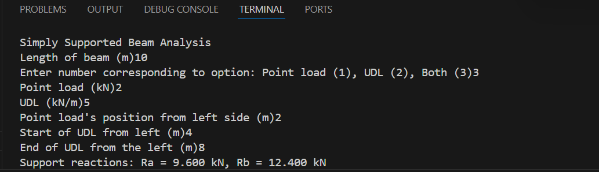
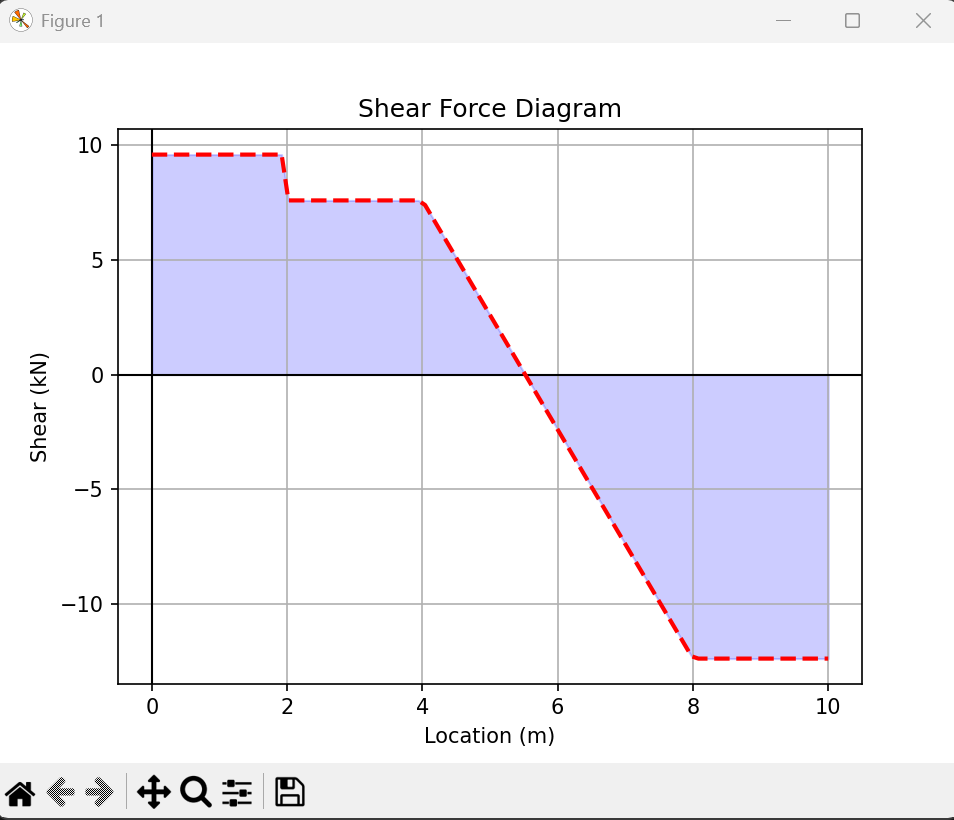
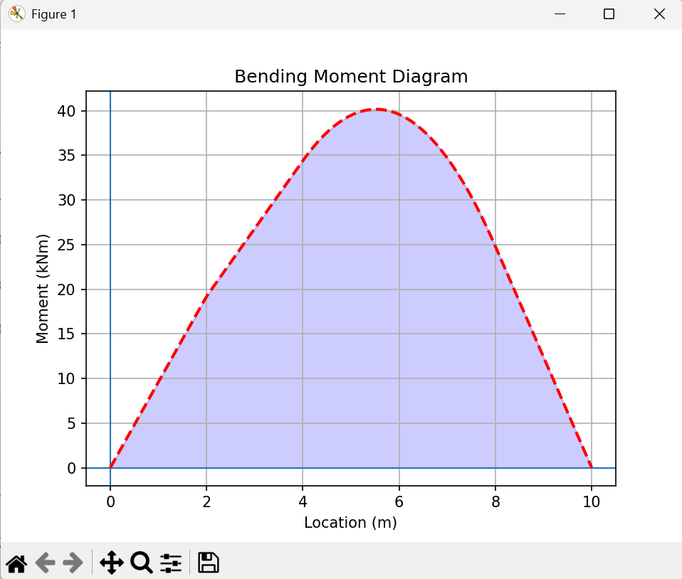

# Beam Analysis 

A Python tool for analysing a simply supported beam under various loading conditions.  
Calculates **support reactions**, **shear force**, and **bending moment** — with clear plotted outputs for engineering applications.

---

##  Features
- Handles **point load**, **uniformly distributed load (UDL)**, or **both**
- Calculates:
  - Reactions at supports  
  - Shear Force Diagram (SFD)  
  - Bending Moment Diagram (BMD)
- Visualises results using Matplotlib

---

## Example Output

Below is an example of the plotted results for a 10m simply supported beam with a 2kN point load at 2m and a 5kN/m uniformly distributed load (UDL) applied from 4m to 8m.








##  Requirements
Make sure you have Python 3.8+ installed, then install dependencies:
```bash
pip install numpy matplotlib
